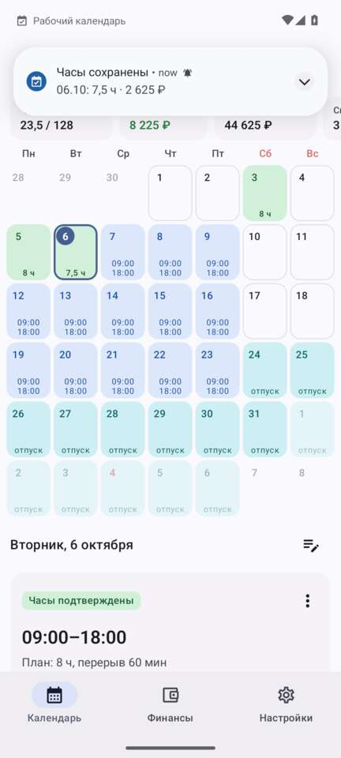
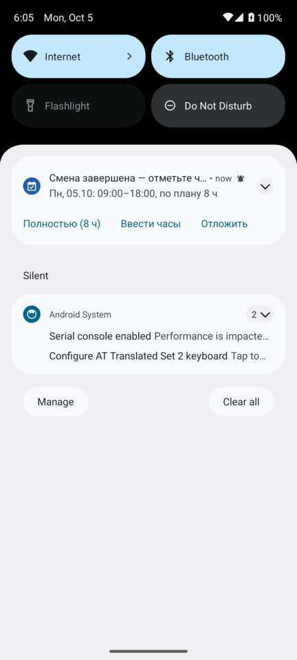
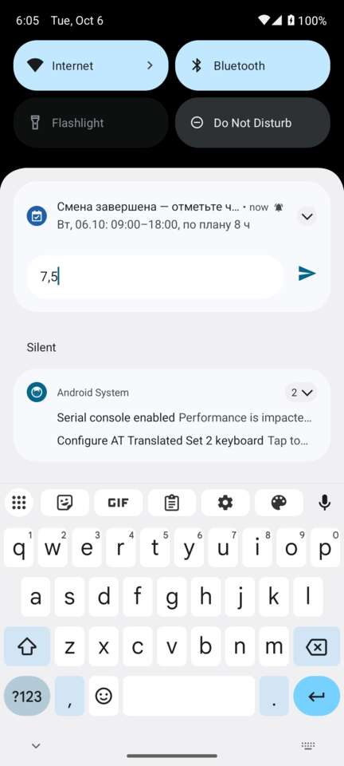
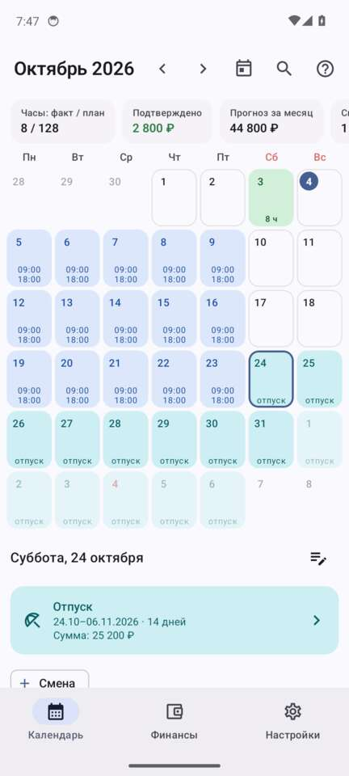
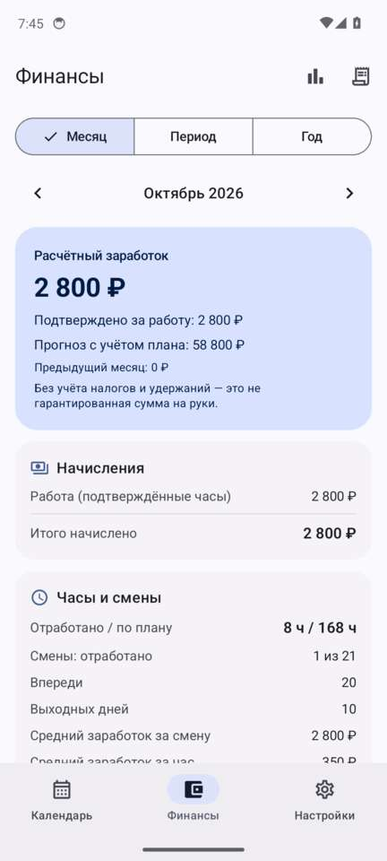
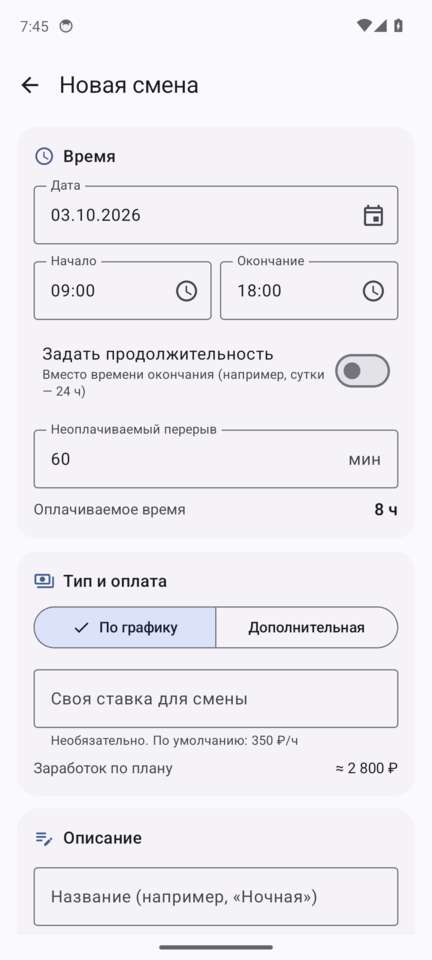
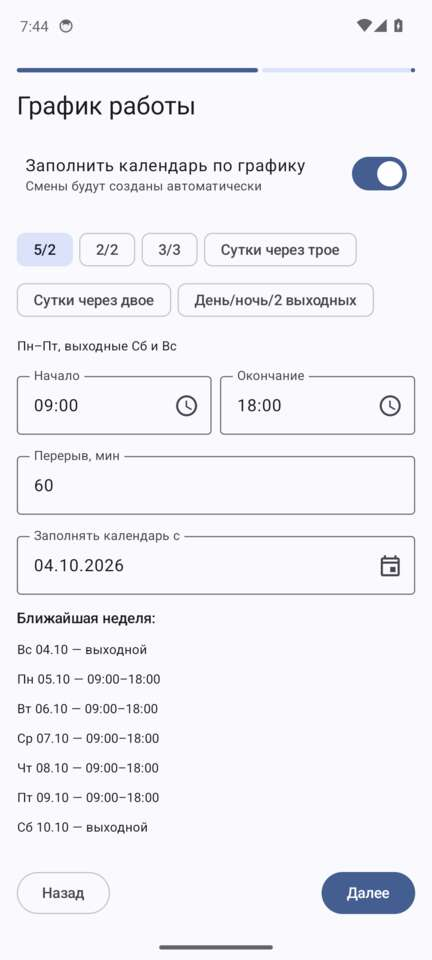
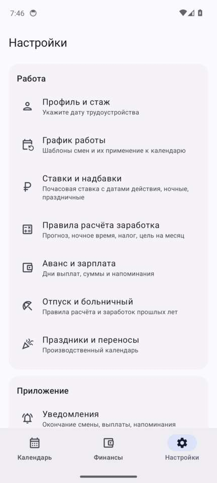

<div align="center">

# 📅 Рабочий календарь

**Личный календарь смен для Android: график работы, отработанные часы, заработок, аванс и зарплата,
отпуска и больничные. Всё считается и хранится только на телефоне — без интернета и аккаунтов.**

[](https://github.com/cenior-pomidor/Calendar/actions/workflows/workcalendar.yml)


[](LICENSE.md)

### [⬇️ Скачать APK — последняя версия](https://github.com/cenior-pomidor/Calendar/releases/latest)

</div>

> [!NOTE]
> **Приложение целиком написано вайб-кодингом с помощью Claude Opus 5.5** (Anthropic) в Claude Code.
> Автор сформулировал требования в техническом задании и проверял результат на своём телефоне;
> архитектуру, код, тесты, сборку, CI, релизы и эту документацию сделала модель.
> Подробности — в разделе [«Как это сделано»](#-как-это-сделано).

<table>
  <tr>
    <td align="center"><br><sub>Календарь: смены, подтверждённые часы, отпуск</sub></td>
    <td align="center"><br><sub>Уведомление после смены</sub></td>
    <td align="center"><br><sub>Ввод часов прямо в шторке</sub></td>
    <td align="center"><br><sub>Отпуск с расчётом отпускных</sub></td>
  </tr>
  <tr>
    <td align="center"><br><sub>Финансы</sub></td>
    <td align="center"><br><sub>Новая смена</sub></td>
    <td align="center"><br><sub>Мастер первого запуска</sub></td>
    <td align="center"><br><sub>Настройки</sub></td>
  </tr>
</table>

## Содержание

- [Установка](#-установка)
- [Возможности](#-возможности)
- [Как устроено](#-как-устроено)
- [Зависимости и библиотеки](#-зависимости-и-библиотеки)
- [Разрешения](#-разрешения)
- [Сборка из исходников](#-сборка-из-исходников)
- [Проверка качества](#-проверка-качества)
- [Как это сделано](#-как-это-сделано)
- [Известные ограничения](#-известные-ограничения)
- [Структура репозитория](#-структура-репозитория)
- [Лицензия и благодарности](#-лицензия-и-благодарности)

## 📲 Установка

1. Скачайте `WorkCalendar-<версия>.apk` со страницы [последнего релиза](https://github.com/cenior-pomidor/Calendar/releases/latest).
2. Откройте файл на телефоне и разрешите установку из этого источника
   (если Play Protect предупредит о неизвестном приложении — «Всё равно установить»).
3. При первом запуске пройдите мастер настройки и разрешите уведомления.

Требуется **Android 8.0 или новее**. Все сборки подписаны одним ключом, поэтому новые версии
ставятся поверх старых **без потери данных**. Подробная инструкция пользователя —
[workcalendar/README.md](workcalendar/README.md).

## ✨ Возможности

### Календарь и графики работы
- Месячный календарь: цвет ячейки показывает статус дня — смена запланирована, идёт, ждёт отметки
  часов, часы подтверждены, дополнительная смена, не состоялась, отменена или перенесена, отпуск,
  больничный, другое отсутствие. Праздники и перенесённые выходные выделены, точка — заметка к дню.
- В ячейке — время смены или отработанные часы, по желанию — заработок за день.
- Сводка месяца: часы факт / план, подтверждённый заработок, прогноз, количество смен.
- Панель выбранного дня: смены с действиями, отсутствие, заметка, кнопки «Смена», «Отпуск»,
  «Больничный», «Другое»; долгое нажатие на день — сразу новая смена.
- Плавное перелистывание месяцев свайпом и стрелками, кнопка «Сегодня»; в альбомной ориентации
  календарь и панель дня стоят рядом.
- Шаблоны графиков: по дням недели (своё время для каждого дня) и циклы любой длины — 5/2, 2/2,
  3/3, сутки через трое, сутки через двое, день/ночь/2 выходных, свой цикл; неоплачиваемый
  перерыв; смены через полночь и суточные.
- Применение графика с выбранной даты или на период с **предпросмотром**: сколько смен будет
  добавлено, изменено и удалено и какие дни, изменённые вручную, сохранятся. Подтверждённые смены
  графиком не меняются никогда.
- Автозаполнение календаря на несколько месяцев вперёд (горизонт продлевается сам), история
  применённых графиков с копией шаблона.
- Производственный календарь РФ на 2025–2026 годы (праздники по ст. 112 ТК РФ и переносы),
  свои праздники и рабочие дни, опция «не ставить смены в праздники».

### Учёт отработанного времени
- После окончания смены приходит уведомление с кнопками **«Полностью (8 ч)»**, **«Ввести часы»**
  (ответ прямо в шторке: `7,5`, `7:30`, `7ч30м`, `0` — смена не состоялась) и **«Отложить»**.
- Варианты отметки: полностью по плану, количество часов, фактическое начало и окончание с
  перерывом, «смена не состоялась».
- Пока часы не внесены, смена не входит в заработок; проигнорированное уведомление ничего не
  начисляет. Раз в день приходит напоминание о неотмеченных сменах, на отдельном экране их можно
  отметить все по плану.
- Подтверждённые смены защищены: исправление — только после явной разблокировки и с записью в
  журнал; повторное подтверждение заменяет часы, а не добавляет (двойного начисления нет).
- Ночные смены через полночь и переход на летнее/зимнее время учитываются корректно.

### Ручное управление сменами
- Смена на любую дату, в том числе дополнительная в выходной; время, продолжительность
  (например «24 ч»), перерыв, название, заметка и индивидуальная ставка.
- Перенос на другую дату (исходный день помечается «перенесена → дата»), отмена, восстановление,
  «не состоялась», удаление, добавление в системный календарь.
- Ручные изменения приоритетнее графика и не перезаписываются при его повторном применении.

### Заработок и ставки
- Почасовая ставка с датой начала действия; подтверждённые смены хранят ставку на момент
  подтверждения, а при изменении ставки «задним числом» приложение предлагает пересчитать
  прошлые смены или оставить их как есть.
- Надбавки в процентах: ночные (интервал ночи настраивается), праздничные, сверхурочные,
  за дополнительные смены.
- Прогноз по плану и факт по подтверждённым часам, НДФЛ и удержания, цель на месяц.
  Без настроенного налога сумма подписывается как «расчётный заработок», а не «на руки».

### Аванс и зарплата
- Правила выплат: день выплаты, месяц (тот же или следующий), перенос с выходных, период расчёта
  (например, 1–15 число).
- Сумма — процент заработка за период, остаток за месяц минус другие выплаты, фиксированная сумма
  или **своя формула** (`ЗАРАБОТОК * 40%`, `min(ЗАРАБОТОК; 30000)`, переменные ЧАСЫ, СТАВКА,
  ПЛАН, МЕСЯЦ и другие), вычет НДФЛ.
- Ожидаемые суммы и отметка «получено» с фактической суммой, датой и комментарием; полученный аванс
  уменьшает остаток зарплаты; начисления и выплаты хранятся раздельно.
- Напоминание за N дней до выплаты с расчётной суммой, а если данных не хватает — с объяснением,
  чего именно.

### Отпуска, больничные и другие отсутствия
- Даты или количество дней (праздники внутри отпуска не считаются днями отпуска и продлевают его).
- Оплачиваемое или без оплаты; сумма вручную или **автоматический расчёт**:
  - отпускные — по запланированным сменам или по среднему заработку за 12 месяцев
    (ст. 139 ТК РФ, 29,3 дня);
  - больничный — по 255-ФЗ: средний дневной заработок за 2 года / 730 × процент по стажу
    (60/80/100 %) × дни болезни, с минимумом от МРОТ и предельной базой; первые 3 дня оплачивает
    работодатель, остальные — Соцфонд.
- Смены графика на эти даты сохраняются в истории как «заменены отсутствием» и не входят в учёт
  часов и заработка — двойного учёта нет.
- Уведомления: отпускные — за 2 рабочих дня до начала отпуска с суммой; больничный — утром
  в ожидаемые дни выплат.
- Заработок прошлых периодов и стаж до текущей работы — для точного расчёта.

### Финансы и статистика
- Месяц, произвольный период или год; сравнение с прошлым месяцем; прогресс к цели.
- Начисления (работа, отпускные, больничные, премии и удержания, НДФЛ), часы (факт / план,
  дополнительные, сверхурочные, ночные, праздничные), смены (отработано, пропущено, отменено),
  средний заработок за смену и за час.
- История операций с фильтрами, графики «факт / план» за 3, 6 и 12 месяцев.
- Раздел можно закрыть PIN-кодом и отпечатком пальца.

### Уведомления
- Окончание смены, неотмеченные часы, аванс и зарплата, отпускные, больничные — каждое
  включается отдельно, время настраивается, «Отложить» — на заданное время.
- Точные будильники, без повторов и дубликатов; пропущенное уведомление доставляется позже,
  пока оно актуально; устаревшее ежедневное напоминание не показывается.
- Расписание восстанавливается после перезагрузки, обновления приложения, смены времени и часового
  пояса; каждые 6 часов фоновая задача проверяет его и продлевает график.
- Нажатие на уведомление открывает нужный экран.

### Данные и прочее
- Резервная копия всех данных и настроек в файл JSON (например, в Google Диск) и восстановление
  из него; еженедельные автокопии; перед восстановлением сохраняется копия текущих данных.
- Экспорт в CSV для Excel и Google Таблиц (разделитель «;», UTF-8): смены, отсутствия, выплаты,
  начисления — по отдельности или ZIP-архивом; экспорт смен в `.ics`.
- Журнал изменений: подтверждения и исправления часов, ставки, графики, выплаты.
- Виджет на главный экран: месяц с цветами статусов, сегодняшняя смена, неотмеченные часы,
  кнопки «+ Смена» и «Отметить часы».
- Поиск по заметкам, сменам, отсутствиям, выплатам, суммам и датам; заметки к дням.
- Мастер первого запуска: дата трудоустройства, стаж, ставка, график, дни выплат, уведомления.
- Светлая и тёмная тема, цвета Material You; сброс настроек и полное удаление данных с
  двойным подтверждением.

## 🧩 Как устроено

```
workcalendar/
├── domain/   чистая бизнес-логика на Kotlin/JVM, без зависимостей от Android:
│             генерация графиков, расчёт заработка и выплат, отпускные и больничные,
│             планирование уведомлений, резервные копии, экспорт CSV/ICS + юнит-тесты
├── app/      Android-приложение: Room, репозитории, уведомления и будильники,
│             WorkManager, виджет на Glance, интерфейс на Jetpack Compose
└── ci/       сценарий проверки на эмуляторе (adb + uiautomator)
```

- **Смены материализуются в базе.** Шаблон превращается в записи смен с уникальным ключом даты,
  поэтому повторная генерация идемпотентна и не создаёт дубликатов. Удалённые смены графика
  запоминаются, ручные изменения защищены от перезаписи.
- **Деньги — в копейках** (`Long`), без ошибок округления чисел с плавающей точкой.
- **Снимки расчёта.** Подтверждённая смена хранит ставку и итог на момент подтверждения, поэтому
  изменение ставки не переписывает прошлое без вашего согласия.
- **Уведомления планируются чистой функцией** в `domain`, приложение синхронизирует их с
  `AlarmManager` и хранит состояние доставки в базе — отсюда отсутствие повторов.
- **Время смен — местное**, длительность считается с учётом перехода на летнее и зимнее время.
- **Схема базы данных** экспортируется в [`workcalendar/app/schemas`](workcalendar/app/schemas)
  для будущих миграций.

## 📦 Зависимости и библиотеки

| Библиотека | Версия | Для чего |
|---|---|---|
| [Kotlin](https://kotlinlang.org/) (плагины Compose Compiler, Serialization) | 2.3.0 | язык |
| [Jetpack Compose](https://developer.android.com/jetpack/compose): UI, Foundation, Runtime | 1.10.1 | интерфейс |
| [Material 3](https://m3.material.io/) для Compose | 1.4.0 | компоненты, тема, Material You |
| Material Icons Core | 1.7.8 | иконки |
| Activity Compose | 1.12.2 | активити, запрос разрешений, выбор файлов |
| Navigation Compose | 2.9.6 | навигация, переходы из уведомлений и виджета |
| Lifecycle: runtime-compose, viewmodel-compose | 2.10.0 | ViewModel, подписка на данные |
| [Room](https://developer.android.com/training/data-storage/room) (+ KSP 2.3.4, Room Gradle Plugin) | 2.8.4 | локальная база данных SQLite |
| [WorkManager](https://developer.android.com/topic/libraries/architecture/workmanager) | 2.11.0 | фоновая проверка расписания |
| [Glance](https://developer.android.com/jetpack/compose/glance) AppWidget + Material 3 | 1.1.1 | виджет на главный экран |
| Biometric | 1.1.0 | вход в «Финансы» по отпечатку |
| Fragment KTX | 1.8.9 | `FragmentActivity` для окна биометрии |
| Core KTX | 1.17.0 | расширения Android API |
| [kotlinx.coroutines](https://github.com/Kotlin/kotlinx.coroutines) | 1.10.2 | асинхронность и потоки данных |
| [kotlinx.serialization](https://github.com/Kotlin/kotlinx.serialization) JSON | 1.9.0 | резервные копии и настройки |
| desugar_jdk_libs | 2.1.5 | `java.time` на Android 8 |
| [Calendar](https://github.com/kizitonwose/Calendar) (Kizito Nwose): модули `core`, `data`, `compose` | 2.10.x, исходники в репозитории | месячный календарь `HorizontalCalendar` |

**Тесты и инструменты:** JUnit 6.0.2 (Jupiter) и kotlin-test — юнит-тесты; Kotlinter 5.3.0 (ktlint) — стиль кода;
Gradle 8.14.3, Android Gradle Plugin 8.13.2, JDK 17. **CI:** GitHub Actions,
[android-emulator-runner](https://github.com/ReactiveCircus/android-emulator-runner) (эмулятор Android 14),
[action-gh-release](https://github.com/softprops/action-gh-release) (публикация APK).

**Платформа:** minSdk 26 (Android 8.0), targetSdk и compileSdk 36 (Android 16).

## 🔐 Разрешения

| Разрешение | Зачем |
|---|---|
| `POST_NOTIFICATIONS` | уведомления о сменах и выплатах |
| `USE_EXACT_ALARM` (Android 13+), `SCHEDULE_EXACT_ALARM` (Android 12) | напоминания точно в срок |
| `RECEIVE_BOOT_COMPLETED` | восстановление напоминаний после перезагрузки |
| `USE_BIOMETRIC` | вход в раздел «Финансы» по отпечатку |

Библиотеки добавляют служебные `WAKE_LOCK`, `FOREGROUND_SERVICE`, `ACCESS_NETWORK_STATE` (WorkManager)
и `USE_FINGERPRINT` (Biometric, для старых версий Android). **Разрешения на доступ в интернет у
приложения нет** — данные никуда не отправляются.

## 🛠 Сборка из исходников

```bash
git clone https://github.com/cenior-pomidor/Calendar.git
cd Calendar
./gradlew :workcalendar:domain:test          # юнит-тесты бизнес-логики
./gradlew :workcalendar:app:assembleRelease  # APK → workcalendar/app/build/outputs/apk/release/
```

Нужны JDK 17 и Android SDK 36. Ключ подписи `workcalendar/app/signing/workcalendar.jks` хранится в
репозитории, чтобы все сборки ставились друг поверх друга. Для своего ключа задайте переменные
`WORKCAL_KEYSTORE`, `WORKCAL_KEYSTORE_PASSWORD`, `WORKCAL_KEY_ALIAS`, `WORKCAL_KEY_PASSWORD`
(APK с другой подписью не установится поверх текущего без удаления приложения).

## ✅ Проверка качества

- **53 юнит-теста** бизнес-логики: графики и их повторное применение, расчёт заработка, аванс и
  зарплата, отпускные и больничные, уведомления, экспорт и резервные копии, переход на летнее время;
  сценарии 1, 2, 4–10 и 12 из технического задания покрыты отдельными тестами.
- **CI на каждый push** ([workcalendar.yml](.github/workflows/workcalendar.yml)): тесты →
  release-APK с R8 → прогон на эмуляторе Android 14:
  - мастер первого запуска и автозаполнение календаря;
  - перелистывание месяцев — быстрый, медленный и диагональный свайп, кнопка «Сегодня»;
  - создание и подтверждение смены, финансы, статистика, настройки, сохранение отпуска;
  - уведомления: часы эмулятора переводятся на конец смены, проверяются появление уведомления,
    кнопка «Полностью» и ввод часов прямо в шторке;
  - любое падение приложения проваливает сборку, скриншоты экранов сохраняются в артефактах.
- **Релиз** публикуется ручным запуском workflow (`release: true`) только после успешной
  проверки на эмуляторе.

## 🤖 Как это сделано

Приложение «Рабочий календарь» — весь код в [`workcalendar/`](workcalendar), CI, скрипты проверки
и документация — **полностью написано вайб-кодингом с помощью Claude Opus 5.5** в
[Claude Code](https://claude.com/claude-code), без ручного написания кода.

- **Автор** поставил задачу подробным техническим заданием на русском языке (требования к
  графикам, учёту часов, заработку, выплатам, отпускам и больничным, уведомлениям, данным и
  12 сценариев проверки), тестировал приложение на своём телефоне и присылал замечания — например,
  видео с подёргиванием календаря при перелистывании месяцев (исправлено в версии 1.0.1).
- **Модель** спроектировала архитектуру, написала код и тесты, настроила сборку и CI, сама
  собирала проект в GitHub Actions, смотрела скриншоты и разбор интерфейса с эмулятора, находила
  и исправляла ошибки, публиковала релизы и написала документацию.
- **Объём:** около 15,5 тыс. строк Kotlin (приложение — 10,7 тыс., бизнес-логика — 3,8 тыс.,
  тесты — 1 тыс.). Работа заняла один вечер 4 октября 2026 года: версия 1.0.0 вышла примерно
  через два часа после начала сессии, 1.0.1 — ещё через час.
- **Не вайб-кодинг:** библиотека календаря [kizitonwose/Calendar](https://github.com/kizitonwose/Calendar)
  (модули `core`, `data`, `compose`, `view`, `compose-multiplatform`, `sample`) — оригинальная
  работа Kizito Nwose; она используется без изменений.

## 🚧 Известные ограничения

- Расчёт отпускных и больничных **ориентировочный**: учтены основные правила (ст. 139 ТК РФ,
  255-ФЗ), но не все частные случаи — уход за ребёнком, исключаемые периоды, районные
  коэффициенты, индексация. Сумму всегда можно указать вручную.
- Производственный календарь встроен на 2025–2026 годы; переносы следующих лет добавляются вручную.
- НДФЛ — одной ставкой, без прогрессивной шкалы и вычетов.
- Сверхурочные — всё время сверх плана смены, без разделения на первые 2 часа и последующие.
- Синхронизации между устройствами нет (данные только на телефоне); для переноса — резервная копия.
- Автоматическая проверка выполняется на эмуляторе Android 14; приложение собрано под Android 16.

Полный список — в [workcalendar/README.md](workcalendar/README.md#известные-ограничения).

## 🗂 Структура репозитория

| Путь | Что там |
|---|---|
| [`workcalendar/`](workcalendar) | приложение «Рабочий календарь»: [`app`](workcalendar/app), [`domain`](workcalendar/domain), [`ci`](workcalendar/ci), [инструкция](workcalendar/README.md) |
| [`.github/workflows/workcalendar.yml`](.github/workflows/workcalendar.yml) | сборка, тесты, проверка на эмуляторе, публикация релизов |
| `core/`, `data/`, `compose/` | библиотека календаря, используемая приложением |
| `view/`, `compose-multiplatform/`, `sample/`, `docs/` | остальные модули, примеры и документация библиотеки — см. [docs/CalendarLibrary.md](docs/CalendarLibrary.md) |

## 📄 Лицензия и благодарности

Репозиторий — форк [kizitonwose/Calendar](https://github.com/kizitonwose/Calendar) и распространяется
по лицензии MIT, см. [LICENSE.md](LICENSE.md). Спасибо Kizito Nwose за библиотеку календаря.
Оригинальное описание библиотеки — [docs/CalendarLibrary.md](docs/CalendarLibrary.md).
